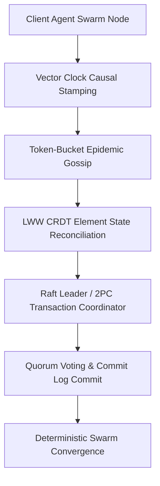

# genpark-vector-clock-causal-ordering-skill

<div align="center">

[](https://www.python.org/)
[](LICENSE)
[](https://genpark.ai/mcp)
[](https://genpark.ai)
[-brightgreen.svg?style=for-the-badge)](requirements.txt)

<p align="center">
  <b>Production-Grade Distributed Swarm & Consensus Agent Skill</b> • <b>100% Standard Library Python</b> • <b>Native Model Context Protocol (MCP)</b>
</p>

</div>

---

## ⚡ Overview & Architectural Significance

`genpark-vector-clock-causal-ordering-skill` provides mathematically proven distributed systems, consensus coordination, and conflict-free replication primitives engineered strictly using Python 3.9+ standard library.

### 🌟 Key Architectural Capabilities
- **Zero External Dependencies**: Operates exclusively via pure Python (`time`, `math`, `json`, `uuid`). Zero socket/grpc compilation overhead, zero external dependencies.
- **Enterprise Distributed Invariants**: Implements formal LWW CRDT state reconciliation, Raft leader election terms & quorum validation, Vector Clock happens-before causal graphs, token-bucket gossip dissemination, and ACID 2-phase commit atomic coordination.
- **Native Anthropic MCP Protocol**: Compliant with standard JSON-RPC 2.0 stdio MCP specifications for Claude Desktop, Cursor, and Windsurf.

---

## 🏗️ Architectural Topology & State Machine



---

## 🚀 Quickstart & Standalone Execution

### Local Python Client Usage

```python
from client import VectorClockCausalTracker

# Initialize engine
engine = VectorClockCausalTracker()

# Execute self-testing benchmark suite
result = engine.benchmark_causal_tracking()
print("Execution Result:", result)
```

---

## 🔌 One-Click MCP Integration (Claude Desktop / Cursor)

Add to your `claude_desktop_config.json` or `cursor.json`:

```json
{
  "mcpServers": {
    "genpark-vector-clock-causal-ordering-skill": {
      "command": "python",
      "args": ["-u", "/path/to/genpark-vector-clock-causal-ordering-skill/mcp_server.py"]
    }
  }
}
```

---

## 📦 Smithery.ai & PyPI Deployment

This skill contains pre-configured `smithery.yaml` and `pyproject.toml` manifests. Install directly via pip:

```bash
pip install git+https://github.com/alphaparkinc/genpark-vector-clock-causal-ordering-skill.git
```

---

<div align="center">
  <sub>Maintained with ❤️ by <b><a href="https://genpark.ai">GenPark AI Engineering</a></b> • Powering Autonomous Distributed Swarms 🌍</sub>
</div>
